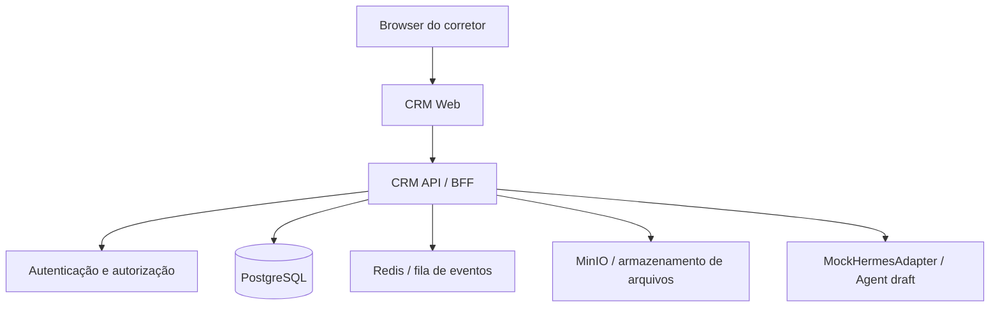

# Arquitetura do sistema

## Ciclo executável atual

O primeiro ciclo usa um monorepo com API, Web futuro e `packages/contracts`.
O `MockHermesAdapter` fica atrás da porta do Agent e não faz chamadas de rede.
Não há `apps/orchestrator`, perfil Hermes, pairing, WhatsApp, outbox ou
dashboard nas rotas atuais; esses componentes são substituições posteriores.

## Visão geral

O sistema terá um CRM central e vários runtimes Hermes isolados no mesmo VPS inicialmente. O CRM será a fonte de verdade para usuários, corretores, leads, conversas, permissões e auditoria.



## Componentes

### CRM Web (ciclo atual: telas mínimas; dashboard completo é roadmap)

Interface para:

- login;
- fluxo de leads, conversas e Agent;
- leads e Kanban;
- conversas;
- agentes;
- conexão do WhatsApp;
- gestão do supervisor.

### CRM API / BFF

Responsável por:

- validar o token de sessão;
- resolver `user_id`, `broker_id` e função;
- aplicar autorização em todas as consultas;
- expor dados ao frontend;
- iniciar sessões de agentes;
- encaminhar chamadas para o Hermes correto;
- registrar auditoria;
- publicar e consumir eventos.

O frontend nunca deve escolher diretamente o perfil Hermes nem acessar seus endpoints internos.

### Hermes Orchestrator (roadmap)

Serviço responsável por manter o mapa entre o CRM e os runtimes Hermes:

```text
broker_id
→ hermes_profile_id
→ gateway interno
→ credencial do gateway
→ sessão WhatsApp
```

Ele também deve controlar timeout, reconexão, estado de disponibilidade e versão do pacote de agentes.

### Hermes runtime por corretor (roadmap)

Cada corretor terá um processo ou container separado com:

- `HERMES_HOME` próprio;
- perfil Hermes próprio;
- diretório de sessão WhatsApp próprio;
- configuração própria;
- credenciais próprias;
- banco de estado próprio;
- logs próprios;
- API key própria;
- limite de recursos próprio.

Os agentes especialistas serão instalados a partir de um pacote versionado comum. A memória privada e as sessões permanecerão no perfil do corretor.

### PostgreSQL (ciclo atual)

Armazena os dados de negócio e de integração do CRM. O Hermes não deve acessar o banco diretamente. O agente deve usar ferramentas ou endpoints da CRM API com escopo de corretor.

### Redis (roadmap de processamento)

Usado para filas, locks, eventos temporários, status de processamento e controle de idempotência. O MVP pode iniciar sem Redis se o fluxo for síncrono, mas a integração com WhatsApp deverá evoluir para uma fila persistente.

### MinIO (roadmap)

Armazena documentos, imagens, vídeos e artefatos. Cada objeto deve conter metadados de proprietário e passar pela autorização da CRM API.

## Fluxo de conversa no CRM (roadmap de integração)

```text
Browser
  → CRM API
  → Hermes Orchestrator
  → Hermes API do perfil
  → eventos de streaming
  → CRM API
  → Browser
```

O Hermes oferece integração programática por API HTTP/SSE e JSON-RPC. A implementação deve encapsular essa escolha no Orchestrator para que o frontend não dependa do protocolo Hermes.

## Fluxo de mensagem do WhatsApp (roadmap)

```text
Lead
  → WhatsApp do corretor
  → bridge Baileys do perfil Hermes
  → agente Atendimento
  → ferramenta CRM com escopo do corretor
  → CRM registra a mensagem
  → outbox decide o envio
  → Hermes envia pelo WhatsApp correto
```

O estado da mensagem deve permitir `draft`, `pending_approval`, `approved`, `sent`, `failed` e `cancelled`.

## Modelo de implantação inicial (roadmap)

```text
reverse-proxy
crm-web
crm-api
hermes-orchestrator
postgres
redis
minio
hermes-broker-001
hermes-broker-002
...
hermes-broker-020
```

Todos os serviços podem começar no mesmo VPS. O desenho deve permitir mover um Hermes runtime para outro VPS sem alterar o `broker_id` nem a interface do CRM.

## Escalabilidade

O primeiro teste deve ser feito com um corretor. Depois, testar dois ou três perfis simultâneos, medir memória, CPU, latência, reconexões e estabilidade do bridge, e somente então provisionar a equipe completa.

O modelo de escala é:

```text
CRM central
  + Hermes runtimes distribuídos
  + Orchestrator com roteamento por broker_id
```
